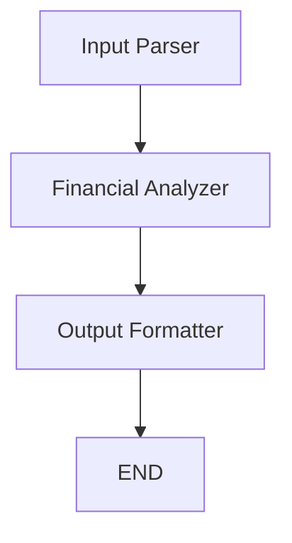

# Financial Analysis Agent with LangGraph and Groq


[](https://langchain-ai.github.io/langgraph/)
[](https://groq.com/)

This project implements an AI agent for financial analysis using LangGraph for workflow orchestration, Groq for LLM inference, and yfinance for stock data retrieval. The agent analyzes stock symbols using moving averages to provide buy/hold/sell recommendations.

## Features

- 🧠 Natural language understanding of financial queries
- 📈 Real-time stock price and moving average calculation
- 🔄 Stateful workflow using LangGraph
- 📊 Structured output in JSON format
- 🧪 Built-in test cases for validation
- 🛠️ Error handling for invalid inputs

## Prerequisites

- Python 3.9+
- Groq API key (free account available at [Groq Cloud](https://console.groq.com/))
- Environment variables set in `.env` file

## Installation

1. Clone the repository:
```bash
git clone https://github.com/Amir-Hossein-shamsi/financial-analysis-agent.git
cd financial-analysis-agent
```

2. Install dependencies:
```bash
pip install -r requirements.txt
```

3. Create a `.env` file with your Groq API key:
```env
GROQ_KEY_API=your_groq_api_key_here
```

## Usage

### Running the Agent
```python
python financial_agent.py
```

### Example Inputs
The agent accepts both natural language and structured inputs:

```python
# Natural language queries
"What is the analysis for Tesla with a 50-day moving average?"
"GOOGL moving average"

# Structured inputs
{"symbol": "ATAI", "window": 20}
```

### Sample Output
```json
{
  "symbol": "TSLA",
  "current_price": 210.75,
  "moving_average": 205.30,
  "recommendation": "Buy"
}
```

## Workflow Architecture



1. **Input Parser**: Converts natural language queries into structured format
2. **Financial Analyzer**: 
   - Fetches current stock price
   - Calculates moving average
   - Generates recommendation
3. **Output Formatter**: Prepares final structured response

## Configuration

| Environment Variable | Description                | Required |
|----------------------|----------------------------|----------|
| `GROQ_KEY_API`       | API key for Groq service   | Yes      |

## Tools

- `get_current_price(symbol)`: Retrieves latest closing price
- `calculate_moving_average(symbol, window)`: Computes moving average over specified window

## Error Handling
The agent provides meaningful error messages for:
- Invalid stock symbols
- Insufficient historical data
- API key issues
- Malformed requests

## Limitations
- Uses Simple Moving Average (SMA) strategy
- Default 14-day window when not specified
- Relies on yfinance for market data

## License
This project is licensed under the MIT License. See [LICENSE](LICENSE) for details.